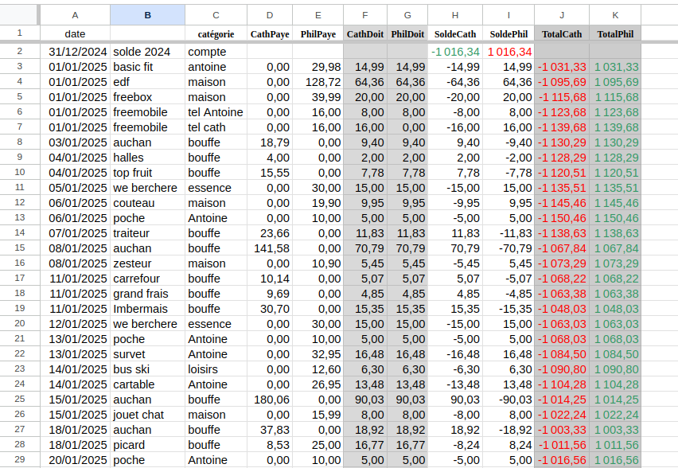

# Client CLI pour édition d'une feuille de compte Google Sheets

Client en Python pour saisir des opérations dans une feuille de compte partagée, en ligne de commande.

## Stack technique

- **Python 3.12+**
- **gspread** : accès à l'API Google Sheets via compte de service
- **prompt_toolkit** : saisie interactive avec autocomplétion et historique

## Prérequis

- Fichier `credentials.json` (compte de service Google Cloud)
- La feuille Google Sheets partagée avec l'email du compte de service (rôle Éditeur)
- `SPREADSHEET_ID` et `SHEET_NAME` configurés dans `compte.py`

## Structure de la feuille de calcul

| Colonne | Nom | Type | Description |
|---|---|---|---|
| A | Date | texte | Date de l'opération (DD/MM/YYYY) |
| B | Quoi | texte | Raison de la dépense / magasin |
| C | Catégorie | texte | Catégorie de la dépense |
| D | CathPaye | nombre | Montant payé par Catherine |
| E | PhilPaye | nombre | Montant payé par Philippe |
| F | CathDoit | nombre/formule | Ce que Catherine aurait dû payer (`=(D+E)/2`) |
| G | PhilDoit | nombre/formule | Ce que Philippe aurait dû payer (`=(D+E)/2`) |
| H | SoldeCath | formule | Ce que Catherine doit à Philippe (`=D-F`) |
| I | SoldePhil | formule | Ce que Philippe doit à Catherine (`=E-G`) |
| J | TotalCath | formule | Cumul de SoldeCath (`=SUM(H2:Hn)`) |
| K | TotalPhil | formule | Cumul de SoldePhil (`=SUM(I2:In)`) |

## Fonctionnement du client

### Saisie des champs

| Champ | Format | Défaut |
|---|---|---|
| Date | `j`, `j m`, ou `j m a` (espaces) | date du jour |
| Quoi | texte libre avec autocomplétion | — |
| Catégorie | texte libre avec autocomplétion | — |
| CathPaye | nombre flottant (virgule ou point) | `0` |
| PhilPaye | nombre flottant (virgule ou point) | `0` |
| CathDoit | nombre flottant ou vide | formule 50% |
| PhilDoit | nombre flottant ou vide | formule 50% |

### Comportement de CathDoit / PhilDoit

- **Entrée vide** sur CathDoit → les deux champs utilisent la formule `=(CathPaye+PhilPaye)/2`. PhilDoit n'est pas demandé.
- **Valeur saisie** sur CathDoit → PhilDoit est demandé. Si `CathPaye+PhilPaye ≠ CathDoit+PhilDoit`, une confirmation est demandée avant d'enregistrer.

### Autocomplétion

Les champs Quoi et Catégorie proposent une autocomplétion (Tab) basée sur les valeurs existantes dans la colonne correspondante de la feuille.

### Boucle de saisie

Après chaque ligne ajoutée, le client propose d'en saisir une autre. `Ctrl+C` ou réponse `n` termine le programme.

## Installation

```bash
python3 -m venv .venv
source .venv/bin/activate
pip install -r requirements.txt
```

## Lancement

```bash
source .venv/bin/activate
python compte.py
```

## Screenshot de la feuille


